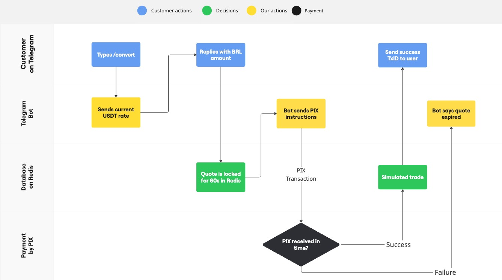

# 💸 USDT Conversion Bot

This project simulates an automated Telegram-based system for converting BRL ↔ USDT with AI-powered customer service, quote lock-in, PIX confirmation, and simulated trades.

## 🔧 Features

- Real-time quote handling
- Temporary quote lock (60s) using Redis
- PIX payment simulation
- Binance trade simulation
- Full Telegram Bot interaction

## 🖼️ Workflow Diagram


## 📦 Requirements

- Python 3.10+
- Redis
- Telethon, ccxt, python-dotenv

## 🚀 How to Run

1. Clone this repo
2. Set up `.env` using `.env.example`
3. Start Redis server (e.g., `redis-server`)
4. Run the bot:
```bash
python main.py
